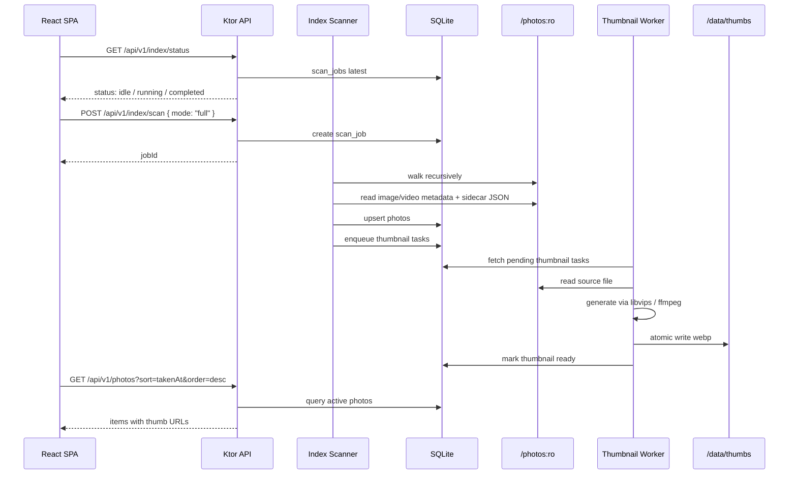

# セルフホスト型フォトビューアー Web アプリケーション 詳細設計書

作成日: 2026-06-26  
対象バージョン: v1 詳細設計  
対象環境: UGREEN DXP4800 Plus / x86_64 Linux / Docker / docker-compose  
バックエンド: Ktor / Kotlin  
フロントエンド推奨: React + TypeScript + Vite + MUI + TanStack Virtual

---

## 前提として置いた仮定

本設計では、ユーザーから提示された前提を固定条件として扱う。実装前に追加確認が必要な点は最後の「主要なリスクと未確定事項」にまとめる。

1. 写真実体はホスト側 `~/Photos` 配下に存在し、コンテナ内では `/photos` に読み取り専用でマウントする。
2. アプリの永続データはコンテナ内 `/data` に集約する。SQLite DB、サムネイルキャッシュ、ジョブ状態、将来の設定値をここに置く。
3. v1 は LAN 内利用前提でアプリ認証なし。ただし Cloudflare Tunnel + Cloudflare Access を後付けできるよう、認証フックと相対 URL 前提の設計にする。
4. v1 はフォルダ構造を UI 概念として扱わない。`/photos` 配下を再帰スキャンし、ホームには 1 本のフラットなストリームとして表示する。
5. アルバムは物理フォルダとは無関係な DB 上の独自概念とする。1 つの写真・動画は複数アルバムに所属できる。
6. 「削除」はすべて論理削除であり、物理ファイルの削除・移動・リネームは絶対に行わない。
7. HEIC / RAW は存在しない。画像は JPEG / PNG / GIF / WebP、動画は MP4 を対象とする。ただし MP4 でもブラウザ非対応 codec の可能性は残るため、v1 ではサーバー側トランスコードを行わず、再生不可時は UI でエラーを出す。
8. 撮影日時は Google Takeout JSON と EXIF / 動画メタデータの両方から取得する。Google Photos 上で補正済みの日時を再現するため、原則として Takeout JSON の `photoTakenTime` を最優先する。
9. v1 のユーザーは 1 人とする。複数ユーザー、共有リンク、権限制御は v1 範囲外。ただし将来の Cloudflare Access 認証後にユーザー情報を `Principal` として扱える構造にする。
10. 設定タブは v1 では空でもよいが、実装上は index 進捗やバージョン情報を置ける場所としてルートだけ確保する。

## 実装前に確定した仕様

2026-06-26 の実装開始前確認で以下を確定した。この節は本文中の古い例より優先する。

1. アプリ名は **Pholio**、Kotlin package は `me.matsumo.pholio` とする。
2. フロントエンド package manager は Bun とし、Docker build では `oven/bun:1.3.14-slim` を使う。
3. Java baseline と Kotlin JVM target は Java 21 とする。
4. Docker service / container 名は `pholio`、SQLite DB 名は `/data/pholio.sqlite3` とする。
5. 写真ライブラリのホストパスは `.env` の `PHOTOS_PATH` を必須にする。
6. 永続データのホストパスは `.env` の `DATA_PATH` を必須にし、Docker named volume は v1 既定にしない。
7. Docker 実行ユーザーは `.env` の `PUID` / `PGID` を必須にする。
8. DB が空の初回起動では full scan、既存 DB では `SCAN_ON_STARTUP=true` のとき diff scan を自動実行する。
9. `APP_DEFAULT_TIMEZONE=Asia/Tokyo`、`THUMBNAIL_WORKERS=2`、`THUMBNAIL_PREVIEW_LAZY=true` を既定にする。
10. `preview_lg` は lazy 生成のみとする。
11. Settings には index status、diff / full scan 起動、scan cancel、除外済み写真一覧、復元 UI を置く。
12. 論理削除の UI 文言は「ライブラリから除外」とする。
13. 復元時は `excluded_at_epoch_ms` を消し、既存の `album_photos` により元のアルバム所属へ戻す。
14. 除外済み一覧は除外日時の新しい順とし、missing photo は表示しない。
15. アルバム cover は v1 では自動のみ。指定 UI / API は将来対応とする。
16. Cloudflare Access は v1 では Noop 認証 hook のみ。本 JWT 検証は含めない。
17. 写真詳細は `preview_lg` 表示後に原本画像へ自動差し替え、クリック / タップ拡大を含める。
18. 複数選択は Shift+click 範囲選択を含める。ただし対象は読み込み済み item のみで、全件選択は含めない。
19. 一括 API の上限は 1000 件とし、UI 側で batch 実行する。
20. 隠しファイル / 隠しディレクトリは scan 対象外にする。
21. ブラウザ非対応 MP4 は詳細画面でエラー表示し、v1 ではトランスコードしない。
22. サムネイル生成失敗時は placeholder を表示する。
23. ffmpeg / ffprobe / vipsthumbnail は PATH から探し、環境変数で上書き可能にする。見つからない場合は起動エラーにする。
24. smoke test は Docker smoke とし、必要な写真データは `/tmp` に一時生成する。
25. API error `message` は日本語とする。
26. OpenAPI は実装から生成する。現実的でない箇所が出た場合は、手書き spec + route test 照合へ fallback し、理由を本設計書に残す。
27. Swagger UI を `/api/docs` で提供する。

---

# 1. アーキテクチャ全体像（構成図・データフロー）

## 1.1 全体方針

v1 は **単一 Ktor コンテナ**で API と SPA 静的ファイル配信を担う。家庭内 NAS 上の Docker 運用では、フロントエンド専用 Nginx コンテナを分けるよりも、構成が単純でバックアップ対象も明確になるためである。

採用する主要コンポーネントは以下。

- **Ktor Backend**
  - JSON API
  - SPA 静的配信
  - サムネイル配信
  - 原本ファイル配信
  - インデックススキャンジョブ
  - サムネイル生成ジョブ
  - 将来の Cloudflare Access 認証フック
- **SQLite**
  - 写真・動画メタデータ
  - アルバム
  - 論理削除状態
  - サムネイル生成状態
  - スキャンジョブ状態
- **サムネイルキャッシュ**
  - `/data/thumbs` に WebP で永続保存
  - 原本 fingerprint を URL に含め、長期 HTTP キャッシュ可能にする
- **読み取り専用写真ボリューム**
  - `/photos` から再帰スキャン
  - API 経由でのみ原本を配信
  - DB ID からファイルパスを解決し、パストラバーサルを防ぐ
- **React SPA**
  - Google フォトに近い 3 タブ UI
  - 仮想化グリッド
  - 詳細表示・横スワイプ
  - 複数選択
  - スクロール復元

## 1.2 論理構成図

```mermaid
flowchart LR
    Browser[Browser / React SPA] -->|relative /api/v1/*| Ktor[Ktor App Container]
    Browser -->|GET /assets/*| Ktor
    Browser -->|GET /api/v1/photos/{id}/thumb/*| Ktor
    Browser -->|GET /api/v1/photos/{id}/original| Ktor

    subgraph Ktor App Container
        Static[SPA Static Server]
        Api[API Routes]
        Auth[Auth Hook<br/>v1: Noop<br/>future: Cloudflare Access JWT]
        PhotoSvc[Photo Query Service]
        AlbumSvc[Album Service]
        Indexer[Index Scanner Job]
        ThumbWorker[Thumbnail Worker]
        MediaTools[libvips / ffmpeg / ffprobe]
    end

    Ktor --> SQLite[(SQLite DB<br/>/data/pholio.sqlite3)]
    Ktor --> ThumbCache[(Thumbnail Cache<br/>/data/thumbs)]
    Ktor -->|read only| Photos[(Host ~/Photos<br/>mounted as /photos:ro)]

    Indexer -->|read files + sidecar json| Photos
    Indexer -->|upsert metadata| SQLite
    Indexer -->|enqueue thumbnail tasks| SQLite
    ThumbWorker -->|read source| Photos
    ThumbWorker --> MediaTools
    ThumbWorker -->|write generated webp| ThumbCache
    ThumbWorker -->|update status| SQLite
```

## 1.3 コンテナ・ボリューム構成

```text
Host NAS
├── ${PHOTOS_PATH}/                    # 既存写真ライブラリ。読み取り専用マウント
└── ${DATA_PATH}/                      # Pholio 永続データ。バックアップ対象
    ├── pholio.sqlite3
    ├── pholio.sqlite3-wal
    ├── pholio.sqlite3-shm
    ├── thumbs/
    │   └── ab/cd/<photoId>/<variant>.<fingerprint>.webp
    └── logs/                          # 任意。Docker logging driver だけでも可

Container
├── /app/bin/backend
├── /app/lib/
├── /photos                           # :ro
└── /data                             # host bind 永続データ
```

## 1.4 起動時データフロー

1. Ktor アプリ起動。
2. 環境変数を読み込む。
3. `/photos` が存在し読み取り可能であることを検証する。
4. `/data` が書き込み可能であることを検証する。
5. SQLite をオープンし、`PRAGMA foreign_keys=ON`、`journal_mode=WAL`、`busy_timeout` などを設定する。
6. DB マイグレーションを実行する。
7. サムネイルキャッシュディレクトリを作成する。
8. DB が空の場合は初回フルスキャンを自動開始する。DB が空でない場合は自動差分スキャンを起動するか、設定 `SCAN_ON_STARTUP` に従う。
9. React SPA と API の受付を開始する。

## 1.5 初回スキャン時データフロー



## 1.6 API と静的配信の URL 設計

外部公開時のリバースプロキシ、Cloudflare Tunnel、サブパス公開に矛盾しないよう、アプリ内で絶対 URL を生成しない。

- API ベース: `/api/v1`
- SPA 静的ファイル: `/assets/*`、`/favicon.ico`、`/manifest.webmanifest`
- SPA fallback: `/*` は `index.html` に fallback。ただし `/api/*` は fallback 対象外。
- サムネイル URL: `/api/v1/photos/{photoId}/thumbnail/{variant}?v={fingerprint}`
- 原本 URL: `/api/v1/photos/{photoId}/original?v={sourceFingerprint}`

フロントエンドは `window.location.origin` を組み立てない。`fetch('/api/v1/...')` のように相対パスのみを使う。

---

# 2. 技術スタック選定（フロントエンド含む。比較表とトレードオフ、最終推奨）

## 2.1 最終推奨

**React + TypeScript + Vite + MUI + TanStack Virtual + TanStack Query + Zustand** を採用する。

理由は以下。

1. 3 万枚超のグリッド、ページング、スクロール復元、複数選択、詳細ビュー、横スワイプといった Google フォト寄り UX を短期間で実装しやすい。
2. React エコシステムには仮想化、データ取得、ジェスチャー、ルーティング、アクセシビリティ周辺の成熟ライブラリが揃っている。
3. MUI は完全な Material 3 Expressive 実装ではないが、Material Design 系のコンポーネント、テーマ、IconButton、Dialog、Menu、TopAppBar 相当の実装が安定している。
4. Ktor から SPA を静的配信しやすく、単一コンテナにまとめやすい。
5. AI 実装エージェントが実装する場合にも、React + TypeScript は生成品質とデバッグ容易性が高い。

本設計では **Material 3 Expressive そのものの完全再現ではなく、Google フォト風の Material 3 / Expressive トーンを MUI theme と独自 CSS で寄せる** ことを明確な方針にする。

## 2.2 比較表

| 候補 | 長所 | 短所 | 本アプリとの相性 | 結論 |
|---|---|---|---|---|
| **React + TypeScript + MUI + TanStack Virtual** | 仮想化・ルーティング・状態管理・ジェスチャーの選択肢が豊富。MUI により Material 系 UI を高速実装できる。Ktor から静的配信しやすい。 | MUI は現時点で Material Design 3 / Expressive の完全実装ではない。M3 らしさは theme と独自コンポーネントで補う必要がある。 | 3.3 万枚グリッド、複数選択、スワイプ、スクロール復元の実装速度と安定性が最も高い。 | **採用** |
| Compose Multiplatform for Web / Kotlin/Wasm + Material3 | Kotlin で UI まで書ける。Material 3 コンポーネントの方向性は魅力。バックエンド Kotlin と言語統一できる。 | Web はまだ Beta 系の扱いで、React ほど周辺ライブラリが成熟していない。大量画像グリッド、細かいブラウザ挙動、AI 実装エージェントの実装容易性にリスクがある。 | Kotlin 統一よりも、Web UX の成熟度が重要なアプリ。 | v1 では不採用。将来の再評価候補 |
| Material Web Components | Material 3 ベースの Web Components。React 以外にも使える。 | メンテナンスモードであり、Material 3 Expressive は Web で未実装という制約がある。コンポーネント数と周辺統合も限定的。 | Google フォト級 UX には不足。 | 不採用 |
| Vue + Vuetify / Svelte + UI Kit | SPA 実装は可能。学習コストが低いケースもある。 | MUI + React + TanStack ほど今回の実装パターンに直結するエコシステムではない。AI 実装エージェントへの指示も React の方が安定しやすい。 | 実現可能だが優位性が薄い。 | 不採用 |

## 2.3 フロントエンド採用ライブラリ

| 領域 | 推奨ライブラリ | 用途 |
|---|---|---|
| ビルド | Vite | React SPA の高速ビルド |
| UI | MUI | Material 系コンポーネント、Dialog、Menu、Tabs、IconButton、Tooltip 等 |
| アイコン | MUI Icons | Google Photos 風の操作アイコン |
| ルーティング | React Router | `/home`、`/albums`、`/albums/:albumId`、写真詳細 overlay route |
| サーバー状態 | TanStack Query | 写真一覧、アルバム、スキャン状態、無限読み込み、キャッシュ |
| 仮想化 | TanStack Virtual | ホーム・アルバム詳細の大量グリッド仮想化 |
| クライアント状態 | Zustand | 選択モード、ギャラリーセッション、スクロール復元、UI 設定 |
| ジェスチャー | `@use-gesture/react` | 写真詳細の横スワイプ、長押し補助 |
| 日付表示 | date-fns | 撮影日時表示、グルーピング候補 |

## 2.4 バックエンド採用ライブラリ

| 領域 | 推奨 | 用途 |
|---|---|---|
| Web framework | Ktor 3.x / Netty engine | API と SPA 配信 |
| JSON | kotlinx.serialization | API req/res の型安全な serialization |
| DB | SQLite + sqlite-jdbc + HikariCP | 1 ユーザー・自宅 NAS に最適な軽量永続 DB |
| DB アクセス | 明示的 SQL DAO | keyset pagination と SQLite UDF を扱いやすくする |
| EXIF | metadata-extractor | JPEG EXIF、GPS、撮影日時抽出 |
| 動画 metadata | ffprobe | MP4 duration、width/height、codec、creation_time |
| 画像サムネイル | libvips CLI (`vipsthumbnail`) | JPEG / PNG / GIF / WebP の高速縮小・WebP 出力 |
| 動画サムネイル | ffmpeg | MP4 から poster frame 抽出 |
| ログ | Logback + JSON pattern 任意 | Docker logs で確認可能にする |

## 2.5 SQLite を選ぶ理由

このアプリは自宅 NAS 上で 1 人が使う読み取り中心のアプリであり、データ規模は写真・動画約 3.4 万件である。SQLite は以下の理由で適している。

- 単一ファイルでバックアップしやすい。
- Docker Compose で DB コンテナを増やす必要がない。
- 3.4 万件程度のメタデータ検索・ソート・アルバム join は適切な index で十分高速。
- WAL モードにより、スキャンジョブの書き込み中でも API 読み取りを継続しやすい。
- 物理写真を削除しない設計のため、DB が破損してもインデックス部分は再構築できる。ただしアルバムと論理削除状態はバックアップ対象にする。

PostgreSQL は将来の複数ユーザー、全文検索、地図検索、共有機能には有利だが、v1 の運用コストに対して過剰である。

---

# 3. データモデル / DB スキーマ（テーブル定義）

## 3.1 ID 設計

### Photo ID

`photos.id` は **正規化した相対パスの SHA-256 hex 先頭 32 桁**を使う。

```text
photoId = hex(sha256(normalizedRelativePath))[0, 32]
```

例:

```text
relative_path: Takeout/Google Photos/2020/IMG_0001.JPG
id:            8f32a5a1e6d0f4b1a0c59f41fba102aa
```

この方式の意図は以下。

- API で物理パスを露出しない。
- 再スキャンしても同じパスなら同じ ID になる。
- 171GB 全体に content hash をかける初回コストを避ける。
- 「物理ファイルをリネームしたら別 asset として扱う」という割り切りをする。

将来、重複検出やリネーム追跡が必要になった場合は、別カラム `content_hash` を非同期に追加する。

### Album ID

`albums.id` は ULID 文字列を使う。

```text
albumId = ULID()
```

理由は、作成順ソートとログ可読性を両立できるため。

## 3.2 共通時刻表現

DB にはすべて **Unix epoch milliseconds / UTC** を `INTEGER` で保存する。

API レスポンスでは、機械処理用に `epochMs`、UI 表示用に ISO-8601 UTC 文字列を返す。

```json
{
  "takenAtEpochMs": 1704067200000,
  "takenAt": "2024-01-01T00:00:00.000Z"
}
```

## 3.3 SQLite PRAGMA

アプリ起動時、各 connection 初期化時に以下を設定する。

```sql
PRAGMA foreign_keys = ON;
PRAGMA journal_mode = WAL;
PRAGMA synchronous = NORMAL;
PRAGMA busy_timeout = 5000;
PRAGMA temp_store = MEMORY;
```

運用上、DB backup 時は `sqlite3 .backup` 相当のオンラインバックアップか、アプリ停止後に `sqlite3`、`-wal`、`-shm` をまとめてコピーする。

## 3.4 `app_meta`

アプリ全体の小さな状態を保存する。

```sql
CREATE TABLE app_meta (
  key TEXT PRIMARY KEY,
  value TEXT NOT NULL,
  updated_at_epoch_ms INTEGER NOT NULL
);
```

代表キー:

| key | value |
|---|---|
| `schema_version` | 現在のスキーマバージョン |
| `library_revision` | スキャン完了ごとに増やす整数 |
| `last_full_scan_finished_at` | epoch ms |
| `thumbnail_variant_version` | variant 定義変更時に増やす整数 |

## 3.5 `photos`

写真・動画の主テーブル。物理ファイルを削除しないため、論理削除・missing 状態もここに残す。

```sql
CREATE TABLE photos (
  id TEXT PRIMARY KEY,

  relative_path TEXT NOT NULL UNIQUE,
  filename TEXT NOT NULL,
  filename_sort_key TEXT NOT NULL,
  extension TEXT NOT NULL,
  media_type TEXT NOT NULL CHECK (media_type IN ('image', 'video')),
  mime_type TEXT NOT NULL,

  file_size_bytes INTEGER NOT NULL,
  file_mtime_epoch_ms INTEGER NOT NULL,
  source_fingerprint TEXT NOT NULL,

  first_seen_at_epoch_ms INTEGER NOT NULL,
  indexed_at_epoch_ms INTEGER NOT NULL,
  last_seen_at_epoch_ms INTEGER NOT NULL,
  missing_since_epoch_ms INTEGER,
  excluded_at_epoch_ms INTEGER,

  width INTEGER,
  height INTEGER,
  duration_ms INTEGER,
  orientation INTEGER,

  taken_at_epoch_ms INTEGER NOT NULL,
  taken_at_source TEXT NOT NULL CHECK (
    taken_at_source IN ('takeout_json', 'exif', 'video_metadata', 'file_mtime', 'unknown')
  ),
  exif_taken_at_epoch_ms INTEGER,
  takeout_taken_at_epoch_ms INTEGER,
  video_created_at_epoch_ms INTEGER,
  timezone_offset_minutes INTEGER,

  gps_lat REAL,
  gps_lng REAL,
  gps_alt REAL,
  gps_source TEXT CHECK (gps_source IN ('takeout_geoData', 'takeout_geoDataExif', 'exif', 'none')),

  camera_make TEXT,
  camera_model TEXT,
  sidecar_relative_path TEXT,

  metadata_status TEXT NOT NULL DEFAULT 'pending' CHECK (metadata_status IN ('pending', 'ready', 'failed')),
  metadata_error TEXT,
  metadata_version INTEGER NOT NULL DEFAULT 1,

  created_at_epoch_ms INTEGER NOT NULL,
  updated_at_epoch_ms INTEGER NOT NULL
);
```

### `source_fingerprint`

サムネイル URL の cache busting に使う。

```text
sourceFingerprint = sha1(relativePath + ':' + fileSizeBytes + ':' + fileMtimeEpochMs + ':' + thumbnailVariantVersion)
```

content hash ではないため、ファイル内容だけが変わって mtime / size が変わらないケースは検知できない。NAS 上の通常運用では mtime 変更を前提とする。

### active photo 条件

ホーム・アルバム詳細に表示する対象は以下。

```sql
excluded_at_epoch_ms IS NULL
AND missing_since_epoch_ms IS NULL
```

論理削除済み、または再スキャンで物理ファイルが見つからなくなったものは一覧に出さない。

## 3.6 `photos` indexes

ソート要件を満たすため、active photo 用 partial index を作る。

```sql
CREATE INDEX idx_photos_active_taken_desc
ON photos (taken_at_epoch_ms DESC, id ASC)
WHERE excluded_at_epoch_ms IS NULL AND missing_since_epoch_ms IS NULL;

CREATE INDEX idx_photos_active_taken_asc
ON photos (taken_at_epoch_ms ASC, id ASC)
WHERE excluded_at_epoch_ms IS NULL AND missing_since_epoch_ms IS NULL;

CREATE INDEX idx_photos_active_name_asc
ON photos (filename_sort_key ASC, id ASC)
WHERE excluded_at_epoch_ms IS NULL AND missing_since_epoch_ms IS NULL;

CREATE INDEX idx_photos_active_name_desc
ON photos (filename_sort_key DESC, id ASC)
WHERE excluded_at_epoch_ms IS NULL AND missing_since_epoch_ms IS NULL;

CREATE INDEX idx_photos_active_indexed_desc
ON photos (indexed_at_epoch_ms DESC, id ASC)
WHERE excluded_at_epoch_ms IS NULL AND missing_since_epoch_ms IS NULL;

CREATE INDEX idx_photos_active_indexed_asc
ON photos (indexed_at_epoch_ms ASC, id ASC)
WHERE excluded_at_epoch_ms IS NULL AND missing_since_epoch_ms IS NULL;

CREATE INDEX idx_photos_relative_path
ON photos (relative_path);

CREATE INDEX idx_photos_source_fingerprint
ON photos (source_fingerprint);
```

ランダムソートは seed 依存のため通常 index は使わない。対象件数が約 3.4 万件であるため、seeded hash による全件計算 + sort を許容する。

## 3.7 `albums`

```sql
CREATE TABLE albums (
  id TEXT PRIMARY KEY,
  name TEXT NOT NULL,
  name_sort_key TEXT NOT NULL,
  cover_photo_id TEXT REFERENCES photos(id) ON DELETE SET NULL,

  created_at_epoch_ms INTEGER NOT NULL,
  updated_at_epoch_ms INTEGER NOT NULL,
  deleted_at_epoch_ms INTEGER
);

CREATE INDEX idx_albums_active_created_desc
ON albums (created_at_epoch_ms DESC, id ASC)
WHERE deleted_at_epoch_ms IS NULL;

CREATE INDEX idx_albums_active_name
ON albums (name_sort_key ASC, id ASC)
WHERE deleted_at_epoch_ms IS NULL;
```

アルバム削除は `deleted_at_epoch_ms` をセットするだけで、`album_photos` は残す。

## 3.8 `album_photos`

1 枚の写真・動画は複数アルバムに所属できる。アルバムからの除去も論理削除にする。

```sql
CREATE TABLE album_photos (
  album_id TEXT NOT NULL REFERENCES albums(id) ON DELETE RESTRICT,
  photo_id TEXT NOT NULL REFERENCES photos(id) ON DELETE RESTRICT,

  added_at_epoch_ms INTEGER NOT NULL,
  removed_at_epoch_ms INTEGER,

  PRIMARY KEY (album_id, photo_id)
);

CREATE INDEX idx_album_photos_album_active
ON album_photos (album_id, removed_at_epoch_ms, photo_id);

CREATE INDEX idx_album_photos_photo_active
ON album_photos (photo_id, removed_at_epoch_ms, album_id);
```

同じ写真を再追加する場合は insert ではなく以下のように update する。

```sql
UPDATE album_photos
SET removed_at_epoch_ms = NULL,
    added_at_epoch_ms = :now
WHERE album_id = :albumId AND photo_id = :photoId;
```

存在しない場合のみ insert する。

## 3.9 `photo_thumbnails`

各 photo / variant ごとの生成状態を管理する。

```sql
CREATE TABLE photo_thumbnails (
  photo_id TEXT NOT NULL REFERENCES photos(id) ON DELETE RESTRICT,
  variant TEXT NOT NULL CHECK (variant IN ('grid_sm', 'grid_md', 'preview_lg')),

  status TEXT NOT NULL CHECK (status IN ('pending', 'ready', 'failed', 'stale')),
  format TEXT NOT NULL DEFAULT 'webp',
  relative_cache_path TEXT,
  width INTEGER,
  height INTEGER,
  size_bytes INTEGER,

  source_fingerprint TEXT NOT NULL,
  attempts INTEGER NOT NULL DEFAULT 0,
  locked_until_epoch_ms INTEGER,
  last_error TEXT,

  generated_at_epoch_ms INTEGER,
  created_at_epoch_ms INTEGER NOT NULL,
  updated_at_epoch_ms INTEGER NOT NULL,

  PRIMARY KEY (photo_id, variant)
);

CREATE INDEX idx_photo_thumbnails_pending
ON photo_thumbnails (status, updated_at_epoch_ms);

CREATE INDEX idx_photo_thumbnails_photo
ON photo_thumbnails (photo_id);
```

`relative_cache_path` は `/data/thumbs` からの相対パスのみ保存する。

例:

```text
ab/cd/8f32a5a1e6d0f4b1a0c59f41fba102aa/grid_md.2c8bc9d.webp
```

## 3.10 `scan_jobs`

```sql
CREATE TABLE scan_jobs (
  id TEXT PRIMARY KEY,
  mode TEXT NOT NULL CHECK (mode IN ('full', 'diff')),
  status TEXT NOT NULL CHECK (status IN ('queued', 'running', 'completed', 'failed', 'cancelled')),

  total_files_estimated INTEGER,
  files_seen INTEGER NOT NULL DEFAULT 0,
  media_files_seen INTEGER NOT NULL DEFAULT 0,
  sidecar_json_seen INTEGER NOT NULL DEFAULT 0,
  photos_inserted INTEGER NOT NULL DEFAULT 0,
  photos_updated INTEGER NOT NULL DEFAULT 0,
  photos_unchanged INTEGER NOT NULL DEFAULT 0,
  photos_marked_missing INTEGER NOT NULL DEFAULT 0,
  thumbnail_tasks_enqueued INTEGER NOT NULL DEFAULT 0,
  errors_count INTEGER NOT NULL DEFAULT 0,

  current_relative_path TEXT,
  cancel_requested INTEGER NOT NULL DEFAULT 0,
  error_summary TEXT,

  started_at_epoch_ms INTEGER,
  finished_at_epoch_ms INTEGER,
  created_at_epoch_ms INTEGER NOT NULL,
  updated_at_epoch_ms INTEGER NOT NULL
);

CREATE INDEX idx_scan_jobs_created_desc
ON scan_jobs (created_at_epoch_ms DESC);
```

## 3.11 `scan_errors`

```sql
CREATE TABLE scan_errors (
  id INTEGER PRIMARY KEY AUTOINCREMENT,
  job_id TEXT NOT NULL REFERENCES scan_jobs(id) ON DELETE CASCADE,
  relative_path TEXT,
  phase TEXT NOT NULL CHECK (phase IN ('walk', 'sidecar', 'metadata', 'db', 'thumbnail_enqueue')),
  message TEXT NOT NULL,
  stack_trace TEXT,
  created_at_epoch_ms INTEGER NOT NULL
);

CREATE INDEX idx_scan_errors_job
ON scan_errors (job_id, created_at_epoch_ms ASC);
```

## 3.12 将来拡張用テーブル候補

v1 では作成しないが、将来の設計余地として以下を想定する。

| テーブル | 用途 |
|---|---|
| `users` | Cloudflare Access 後のユーザー別設定 |
| `photo_tags` | タグ付け |
| `faces` / `photo_faces` | 顔認識 |
| `photo_hashes` | perceptual hash、重複検出 |
| `saved_searches` | 検索条件保存 |
| `audit_logs` | 操作履歴 |

---

# 4. サムネイル & インデックス基盤の設計（スキャン・生成・キャッシュ・動画対応）

## 4.1 対象拡張子

v1 でインデックス対象とする拡張子は以下。

```text
Images: .jpg, .jpeg, .png, .gif, .webp
Videos: .mp4
Sidecar: .json
```

拡張子判定は case-insensitive とする。`.JPG`、`.JPEG`、`.MP4` も対象。

## 4.2 スキャン方針

### フルスキャン

フルスキャンは `/photos` 配下を再帰的に walk し、全対象ファイルを DB と照合する。

処理順:

1. まず `.json` sidecar を収集し、sidecar map を作る。
2. 画像・動画ファイルを順次処理する。
3. 各ファイルについて `relative_path` を正規化する。
4. `photoId = sha256(relative_path)` を算出する。
5. DB に同じ `relative_path` が存在するか確認する。
6. 存在しない場合は metadata 抽出して insert。
7. 存在するが `file_size_bytes` または `file_mtime_epoch_ms` が変わった場合は metadata を再抽出して update。既存の `excluded_at_epoch_ms` は維持する。
8. 存在し、size / mtime が同じ場合は `last_seen_at_epoch_ms` のみ更新する。
9. スキャン終了後、今回見つからなかった既存 photo は `missing_since_epoch_ms` をセットする。
10. 新規・更新された photo について thumbnail task を enqueue する。

### 差分スキャン

差分スキャンもファイルシステム walk は行う。Linux の inotify だけに依存しない。NAS 再起動や Docker 停止中の変更を取りこぼさないためである。

差分スキャンでは以下を省略できる。

- 既存ファイルで size / mtime が同じ場合の EXIF 再抽出
- 既存ファイルで thumbnail が ready かつ fingerprint が同じ場合の thumbnail enqueue

## 4.3 symlink 方針

デフォルトでは symlink を辿らない。

理由:

- ループを避ける。
- `/photos` 外のファイルを誤って公開しない。
- Docker readonly mount の境界を保ちやすい。

環境変数 `SCAN_FOLLOW_SYMLINKS=true` は将来追加できるが、v1 では false 固定でよい。

## 4.4 サイドカー JSON マッチング

Google Takeout の JSON はファイル名と完全一致しないケースがあるため、以下の優先順位で同一ディレクトリ内から探す。

対象ファイル:

```text
/path/to/IMG_0001.JPG
```

候補優先順:

1. `IMG_0001.JPG.json`
2. `IMG_0001.jpg.json` / case-insensitive variant
3. `IMG_0001.json`
4. JSON 内の `title` が `IMG_0001.JPG` と一致するもの
5. ファイル名が長すぎて Takeout 側で切り詰められているケースは、同一ディレクトリ内で `title` 一致を最終手段にする

複数候補が見つかった場合は、以下の順で決定する。

1. exact path match
2. JSON `title` exact match
3. `photoTakenTime.timestamp` を持つもの
4. ファイル名の辞書順で最初

衝突した場合は `scan_errors` に warning 扱いで記録する。処理は継続する。

## 4.5 撮影日時の優先順位

Google Photos に近い表示を目指すため、撮影日時は以下の優先順位で決める。

1. **Takeout JSON `photoTakenTime.timestamp`**
   - Unix seconds として扱い UTC epoch ms に変換する。
   - Google Photos 上でユーザーが日時補正していた場合、この値が UI 体験に近い。
2. **EXIF `DateTimeOriginal` + `OffsetTimeOriginal`**
   - offset があれば UTC に正確変換する。
3. **EXIF `DateTimeOriginal` / `CreateDate` offset なし**
   - `APP_DEFAULT_TIMEZONE` で解釈する。デフォルトは `Asia/Tokyo`。
4. **MP4 metadata `creation_time`**
   - ffprobe で取得できる場合に使用する。
5. **file mtime**
   - 最終 fallback。`taken_at_source = 'file_mtime'` とする。
6. **unknown**
   - 通常は file mtime があるため到達しない。何らかの理由で mtime も取れない場合のみ `indexed_at` を入れ `taken_at_source = 'unknown'` とする。

DB には `takeout_taken_at_epoch_ms`、`exif_taken_at_epoch_ms`、`video_created_at_epoch_ms` も保存し、最終採用値を `taken_at_epoch_ms` に入れる。

日時ソースの差が 24 時間以上ある場合、`scan_errors` に warning を残す。UI には v1 では表示しない。

## 4.6 GPS の優先順位

v1 では地図表示は実装しないが、将来の地図・場所検索に備えて保存する。

優先順位:

1. Takeout JSON `geoData`
2. Takeout JSON `geoDataExif`
3. EXIF GPS
4. なし

`latitude=0`、`longitude=0` は実データでない可能性が高いため、JSON 由来でも `none` として扱う。ただし赤道・本初子午線近辺の写真を厳密に扱いたい場合は将来設定化する。

## 4.7 寸法・動画 duration 抽出

### 画像

- JPEG / PNG / GIF は JVM 側で寸法抽出を試みる。
- WebP は件数が少ないため ffprobe fallback を許容する。
- EXIF orientation を考慮し、表示上の width / height を保存する。

### 動画

ffprobe を使って以下を抽出する。

- width
- height
- duration_ms
- codec_name
- rotation metadata
- creation_time

codec は v1 DB スキーマには入れないが、再生不可調査に役立つため metadata JSON カラムを将来追加してもよい。v1 ではログに残す程度でよい。

## 4.8 サムネイル variant

v1 では 3 variant を生成する。

| variant | 対象 | 生成タイミング | サイズ | 用途 |
|---|---|---:|---:|---|
| `grid_sm` | image / video | 初回スキャン時に事前生成 | 長辺 320px | 4〜8 列グリッド、低 DPR |
| `grid_md` | image / video | 初回スキャン時に事前生成 | 長辺 640px | 1〜4 列グリッド、高 DPR |
| `preview_lg` | image / video poster | 詳細表示時に lazy 生成、または低優先度でバックグラウンド生成 | 長辺 1920px | 写真詳細の初期表示 |

サムネイル形式は **WebP** とする。

WebP を選ぶ理由:

- JPEG / PNG より小さくなりやすい。
- 主要ブラウザでサポートされている。
- 画像・動画 poster を同一形式にできる。
- 透明 PNG も alpha を保持できる。

GIF はグリッドでは先頭フレームの静止画 WebP とする。詳細では原本 GIF を表示するためアニメーションは維持される。

## 4.9 画像サムネイル生成

画像サムネイルは libvips の `vipsthumbnail` を使う。

例:

```bash
vipsthumbnail "$SRC" \
  --size 640x640 \
  --rotate \
  --output "$TMP_OUT[Q=76]"
```

出力先は一時ファイルにし、成功後に atomic rename する。

```text
/data/thumbs/tmp/<taskId>.webp
→ /data/thumbs/ab/cd/<photoId>/grid_md.<fingerprint>.webp
```

失敗時は一時ファイルを削除し、`photo_thumbnails.status = 'failed'`、`last_error` を保存する。

## 4.10 動画サムネイル生成

動画は ffmpeg で 1 フレームを抽出する。

抽出位置:

- duration が 10 秒以上: 10% 位置。ただし最大 30 秒。
- duration が 10 秒未満: 1 秒地点。
- 1 秒未満: 0 秒地点。

例:

```bash
ffmpeg -hide_banner -loglevel error \
  -ss "$SEEK_SECONDS" \
  -i "$SRC" \
  -frames:v 1 \
  -vf "scale='min(640,iw)':-2" \
  -y "$TMP_OUT"
```

実装では `-vf scale` を variant ごとに調整する。出力は WebP。

動画サムネイルには duration badge を UI で重ねる。badge 表示文字列はフロント側で `duration_ms` から `m:ss` または `h:mm:ss` に変換する。

## 4.11 サムネイルキュー

`photo_thumbnails` をタスクキューとして使う。外部 queue コンテナは使わない。

ワーカー処理:

1. `status IN ('pending', 'stale', 'failed')` かつ attempts が閾値未満のタスクを取得する。
2. `locked_until_epoch_ms` を現在時刻 + 5 分に update してロックする。
3. 生成処理を実行する。
4. 成功時:
   - cache file を atomic rename
   - width / height / size_bytes を保存
   - status を `ready` にする
5. 失敗時:
   - attempts を increment
   - last_error を保存
   - attempts < 3 なら `pending` に戻す
   - attempts >= 3 なら `failed`

単一アプリプロセス内の worker で十分だが、将来コンテナを複数起動する場合も `locked_until_epoch_ms` により二重生成を抑制できる。

## 4.12 サムネイル生成並列度

NAS の CPU とディスク I/O を圧迫しすぎないよう、環境変数で制御する。

```text
THUMBNAIL_WORKERS=2
THUMBNAIL_MAX_ATTEMPTS=3
THUMBNAIL_PREVIEW_LAZY=true
```

初期値は 2 worker を推奨する。UGREEN DXP4800 Plus の x86_64 CPU なら 2〜4 で調整可能だが、NAS 本来の用途を妨げないようデフォルトは控えめにする。

## 4.13 サムネイルキャッシュ無効化

以下の場合、既存 thumbnail を stale にする。

- `file_size_bytes` が変わった。
- `file_mtime_epoch_ms` が変わった。
- `thumbnail_variant_version` が変わった。
- variant 定義が変わった。
- 生成ツールのバージョン変更により再生成したい場合、管理コマンドで `thumbnail_variant_version` を増やす。

サムネイル URL は fingerprint を含む。

```text
/api/v1/photos/{id}/thumbnail/grid_md?v={sourceFingerprint}
```

fingerprint が変われば URL が変わるため、旧 URL には長期 cache を付けられる。

## 4.14 キャッシュ掃除

起動時または 1 日 1 回、以下を掃除する。

- DB に存在しない `photoId` の thumb directory
- DB 上 ready で参照されていない古い fingerprint の thumb
- `/data/thumbs/tmp` に残った 24 時間以上古い一時ファイル

物理写真は絶対に削除しない。削除対象は `/data/thumbs` 配下のみ。

## 4.15 スキャン進捗の可視化

v1 UI では設定タブが空でもよいが、初回スキャンは長時間になる可能性があるため、最低限以下は表示する。

- Home 上部に `Indexing... 12,340 / 65,000 files` の小さな banner
- Settings タブに index status card を置く余地
- API は polling でよい。WebSocket / SSE は v1 必須にしない。

---

# 5. API 設計（エンドポイント一覧 + 代表的な req/res）

## 5.1 基本方針

- API prefix は `/api/v1`。
- JSON は camelCase。
- URL はすべて相対パスで返す。
- 一覧 API は **keyset cursor pagination** を採用する。
- `limit` のデフォルトは 120、最大は 500。
- cursor は opaque な Base64URL encoded JSON とする。フロントは cursor の中身を解釈しない。
- 論理削除済み写真、missing 写真、削除済みアルバムは通常 API から見えない。
- エラー形式は統一する。

## 5.2 共通エラー形式

```json
{
  "error": {
    "code": "PHOTO_NOT_FOUND",
    "message": "Photo not found",
    "details": {},
    "requestId": "01JZ..."
  }
}
```

代表 code:

| code | HTTP | 意味 |
|---|---:|---|
| `BAD_REQUEST` | 400 | query/body validation error |
| `INVALID_CURSOR` | 400 | cursor が壊れている、または sort 条件と一致しない |
| `PHOTO_NOT_FOUND` | 404 | photo がない、論理削除済み、missing |
| `ALBUM_NOT_FOUND` | 404 | album がない、削除済み |
| `CONFLICT` | 409 | 同時更新など |
| `INTERNAL_ERROR` | 500 | 想定外エラー |

## 5.3 PhotoSummary

一覧 API が返す最小単位。

```json
{
  "id": "8f32a5a1e6d0f4b1a0c59f41fba102aa",
  "mediaType": "image",
  "filename": "IMG_0001.JPG",
  "takenAt": "2024-01-01T00:00:00.000Z",
  "takenAtEpochMs": 1704067200000,
  "takenAtSource": "takeout_json",
  "indexedAt": "2026-06-26T01:23:45.000Z",
  "indexedAtEpochMs": 1782437025000,
  "width": 4032,
  "height": 3024,
  "durationMs": null,
  "thumbnail": {
    "gridSm": "/api/v1/photos/8f32a5a1e6d0f4b1a0c59f41fba102aa/thumbnail/grid_sm?v=2c8bc9d",
    "gridMd": "/api/v1/photos/8f32a5a1e6d0f4b1a0c59f41fba102aa/thumbnail/grid_md?v=2c8bc9d",
    "previewLg": "/api/v1/photos/8f32a5a1e6d0f4b1a0c59f41fba102aa/thumbnail/preview_lg?v=2c8bc9d"
  }
}
```

動画の場合:

```json
{
  "id": "31fd...",
  "mediaType": "video",
  "filename": "VID_0001.MP4",
  "durationMs": 83000,
  "width": 1920,
  "height": 1080,
  "thumbnail": {
    "gridSm": "/api/v1/photos/31fd.../thumbnail/grid_sm?v=aa81c0e",
    "gridMd": "/api/v1/photos/31fd.../thumbnail/grid_md?v=aa81c0e",
    "previewLg": "/api/v1/photos/31fd.../thumbnail/preview_lg?v=aa81c0e"
  }
}
```

## 5.4 写真一覧: Home

```http
GET /api/v1/photos?sort=takenAt&order=desc&limit=120&cursor=&seed=
```

query:

| name | required | values | 説明 |
|---|---:|---|---|
| `sort` | no | `takenAt`, `name`, `indexedAt`, `random` | default `takenAt` |
| `order` | no | `asc`, `desc` | random では無視。default `desc` |
| `limit` | no | 1..500 | default 120 |
| `cursor` | no | opaque string | 次ページ取得用 |
| `seed` | random の場合推奨 | string | random sort の固定 seed。未指定ならサーバーが発行 |

response:

```json
{
  "items": [
    {
      "id": "8f32a5a1e6d0f4b1a0c59f41fba102aa",
      "mediaType": "image",
      "filename": "IMG_0001.JPG",
      "takenAt": "2024-01-01T00:00:00.000Z",
      "takenAtEpochMs": 1704067200000,
      "takenAtSource": "takeout_json",
      "indexedAt": "2026-06-26T01:23:45.000Z",
      "indexedAtEpochMs": 1782437025000,
      "width": 4032,
      "height": 3024,
      "durationMs": null,
      "thumbnail": {
        "gridSm": "/api/v1/photos/8f32a5a1e6d0f4b1a0c59f41fba102aa/thumbnail/grid_sm?v=2c8bc9d",
        "gridMd": "/api/v1/photos/8f32a5a1e6d0f4b1a0c59f41fba102aa/thumbnail/grid_md?v=2c8bc9d",
        "previewLg": "/api/v1/photos/8f32a5a1e6d0f4b1a0c59f41fba102aa/thumbnail/preview_lg?v=2c8bc9d"
      }
    }
  ],
  "pageInfo": {
    "hasMore": true,
    "nextCursor": "eyJ2IjoxLCJzb3J0IjoidGFrZW5BdCIsLi4u",
    "sort": "takenAt",
    "order": "desc",
    "seed": null,
    "limit": 120,
    "totalCount": 34356,
    "libraryRevision": 12
  }
}
```

random の初回レスポンス例:

```json
{
  "items": [],
  "pageInfo": {
    "hasMore": true,
    "nextCursor": "...",
    "sort": "random",
    "order": "asc",
    "seed": "b7c2c9ad0f6e4d11",
    "limit": 120,
    "totalCount": 34356,
    "libraryRevision": 12
  }
}
```

## 5.5 写真一覧: Album detail

```http
GET /api/v1/albums/{albumId}/photos?sort=takenAt&order=desc&limit=120&cursor=&seed=
```

Home と同じレスポンス形式。filter が album 内に限定されるだけで、ソート・random seed・cursor の仕様は同一。

## 5.6 写真詳細

```http
GET /api/v1/photos/{photoId}
```

response:

```json
{
  "id": "8f32a5a1e6d0f4b1a0c59f41fba102aa",
  "mediaType": "image",
  "filename": "IMG_0001.JPG",
  "takenAt": "2024-01-01T00:00:00.000Z",
  "takenAtEpochMs": 1704067200000,
  "takenAtSource": "takeout_json",
  "width": 4032,
  "height": 3024,
  "durationMs": null,
  "gps": {
    "lat": 35.681236,
    "lng": 139.767125,
    "alt": null,
    "source": "takeout_geoData"
  },
  "camera": {
    "make": "Apple",
    "model": "iPhone"
  },
  "thumbnail": {
    "previewLg": "/api/v1/photos/8f32.../thumbnail/preview_lg?v=2c8bc9d"
  },
  "originalUrl": "/api/v1/photos/8f32.../original?v=2c8bc9d"
}
```

## 5.7 前後写真取得

写真詳細で横スワイプするため、現在の gallery 条件における前後を取得する。

```http
GET /api/v1/photos/{photoId}/neighbors?scope=home&sort=takenAt&order=desc&seed=
GET /api/v1/photos/{photoId}/neighbors?scope=album&albumId={albumId}&sort=random&seed=b7c2c9ad0f6e4d11
```

response:

```json
{
  "previous": {
    "id": "prev...",
    "thumbnail": {
      "previewLg": "/api/v1/photos/prev.../thumbnail/preview_lg?v=..."
    }
  },
  "current": {
    "id": "8f32..."
  },
  "next": {
    "id": "next...",
    "thumbnail": {
      "previewLg": "/api/v1/photos/next.../thumbnail/preview_lg?v=..."
    }
  }
}
```

フロントがすでに TanStack Query の一覧 cache に前後 item を持っている場合、この API は省略できる。直接 URL で詳細を開いた場合や、swipe で読み込み済み範囲を超えた場合に使う。

## 5.8 サムネイル配信

```http
GET /api/v1/photos/{photoId}/thumbnail/{variant}?v={sourceFingerprint}
```

variant:

- `grid_sm`
- `grid_md`
- `preview_lg`

挙動:

- thumbnail ready: `200 image/webp`
- pending / stale: `202` ではなく placeholder WebP を返す。UI の `` が壊れないため。
- failed: placeholder WebP を返し、`X-Thumbnail-Status: failed` を付与する。
- photo not found / excluded / missing: `404`

headers:

```http
Cache-Control: public, max-age=31536000, immutable
ETag: "thumb-{photoId}-{variant}-{fingerprint}"
Content-Type: image/webp
```

`preview_lg` が未生成の場合、リクエスト時に task を enqueue し、今回のレスポンスは placeholder または `grid_md` fallback を返す。

## 5.9 原本配信

```http
GET /api/v1/photos/{photoId}/original?v={sourceFingerprint}
```

挙動:

- DB から `relative_path` を取得する。
- `/photos.resolve(relative_path).normalize()` が `/photos` 配下であることを必ず検証する。
- symlink はデフォルトでは辿らない。
- `excluded_at_epoch_ms` または `missing_since_epoch_ms` がある場合は `404`。
- 画像は inline 表示。
- 動画 MP4 は Range request をサポートする。

headers:

```http
Cache-Control: private, max-age=3600
ETag: "orig-{photoId}-{sourceFingerprint}"
Accept-Ranges: bytes
Content-Disposition: inline; filename="IMG_0001.JPG"
```

Ktor では `PartialContent` plugin を有効化し、動画 seek と resume に対応する。

## 5.10 アルバム一覧

```http
GET /api/v1/albums
```

response:

```json
{
  "items": [
    {
      "id": "01JZABC...",
      "name": "旅行 2024",
      "photoCount": 128,
      "coverPhoto": {
        "id": "8f32...",
        "thumbnailUrl": "/api/v1/photos/8f32.../thumbnail/grid_md?v=..."
      },
      "createdAt": "2026-06-26T01:00:00.000Z",
      "updatedAt": "2026-06-26T01:00:00.000Z"
    }
  ]
}
```

cover photo は以下で決める。

1. `albums.cover_photo_id` が active ならそれ。
2. album 内で `added_at_epoch_ms` が最も新しい active photo。
3. なければ null。

## 5.11 アルバム作成

```http
POST /api/v1/albums
Content-Type: application/json

{
  "name": "旅行 2024"
}
```

response `201 Created`:

```json
{
  "id": "01JZABC...",
  "name": "旅行 2024",
  "photoCount": 0,
  "coverPhoto": null,
  "createdAt": "2026-06-26T01:00:00.000Z",
  "updatedAt": "2026-06-26T01:00:00.000Z"
}
```

フロントは作成成功後に `/albums/{albumId}` へ遷移する。

## 5.12 アルバム詳細

```http
GET /api/v1/albums/{albumId}
```

response:

```json
{
  "id": "01JZABC...",
  "name": "旅行 2024",
  "photoCount": 128,
  "createdAt": "2026-06-26T01:00:00.000Z",
  "updatedAt": "2026-06-26T01:00:00.000Z"
}
```

## 5.13 アルバム名称変更

```http
PATCH /api/v1/albums/{albumId}
Content-Type: application/json

{
  "name": "旅行 2024 夏"
}
```

response:

```json
{
  "id": "01JZABC...",
  "name": "旅行 2024 夏",
  "photoCount": 128,
  "updatedAt": "2026-06-26T02:00:00.000Z"
}
```

## 5.14 アルバム削除

```http
DELETE /api/v1/albums/{albumId}
```

response:

```http
204 No Content
```

DB では `albums.deleted_at_epoch_ms = now` をセットするだけ。`album_photos` は残す。

## 5.15 アルバムへ写真追加

```http
POST /api/v1/albums/{albumId}/photos
Content-Type: application/json

{
  "photoIds": ["8f32...", "31fd..."]
}
```

response:

```json
{
  "added": 2,
  "alreadyPresent": 0,
  "notFound": []
}
```

`photoIds` は最大 1000 件まで。

## 5.16 アルバムから写真除去

HTTP DELETE body はクライアント・プロキシ相性が悪いことがあるため、action endpoint にする。

```http
POST /api/v1/albums/{albumId}/photos:remove
Content-Type: application/json

{
  "photoIds": ["8f32...", "31fd..."]
}
```

response:

```json
{
  "removed": 2,
  "notPresent": 0,
  "notFound": []
}
```

DB では `album_photos.removed_at_epoch_ms = now` をセットする。

## 5.17 写真の論理削除

```http
POST /api/v1/photos:exclude
Content-Type: application/json

{
  "photoIds": ["8f32...", "31fd..."]
}
```

response:

```json
{
  "excluded": 2,
  "notFound": []
}
```

DB では `photos.excluded_at_epoch_ms = now` をセットする。物理ファイル、サムネイル、album_photos は削除しない。サムネイルは cache sweeper の対象にも原則しない。将来 restore したときに高速復帰できるため。

## 5.18 index status

```http
GET /api/v1/index/status
```

response:

```json
{
  "status": "running",
  "currentJob": {
    "id": "01JZSCAN...",
    "mode": "full",
    "filesSeen": 12340,
    "mediaFilesSeen": 6400,
    "sidecarJsonSeen": 5900,
    "photosInserted": 6100,
    "photosUpdated": 12,
    "photosUnchanged": 288,
    "thumbnailTasksEnqueued": 12200,
    "errorsCount": 3,
    "currentRelativePath": "Takeout/Google Photos/2020/IMG_0001.JPG",
    "startedAt": "2026-06-26T01:00:00.000Z"
  },
  "thumbnailQueue": {
    "pending": 22000,
    "ready": 12000,
    "failed": 4
  },
  "libraryRevision": 12
}
```

## 5.19 scan start

```http
POST /api/v1/index/scan
Content-Type: application/json

{
  "mode": "diff"
}
```

response `202 Accepted`:

```json
{
  "jobId": "01JZSCAN...",
  "status": "queued"
}
```

同時に複数 scan は走らせない。既に running の場合は `409 CONFLICT`。

## 5.20 health check

```http
GET /api/v1/health
```

response:

```json
{
  "status": "ok",
  "db": "ok",
  "photoRootReadable": true,
  "dataDirWritable": true,
  "version": "0.1.0"
}
```

Docker healthcheck で使用する。

---

# 6. フロントエンド設計（画面・コンポーネント・状態管理・仮想化・スクロール復元・複数選択・スワイプ）

## 6.1 ルート構成

```text
/
  -> redirect /home
/home
/home/photo/:photoId
/albums
/albums/:albumId
/albums/:albumId/photo/:photoId
/settings
```

写真詳細は overlay route として実装する。通常の一覧から開いた場合は背後のグリッドを維持し、直接 URL で開いた場合は単独詳細画面として表示する。

## 6.2 UI shell

3 タブ構成。

- Home
- Album
- Setting

画面幅により navigation を切り替える。

| 幅 | Navigation |
|---:|---|
| mobile / tablet narrow | bottom navigation bar |
| desktop wide | left navigation rail |

v1 で必須ではないが、Material 3 風にするため navigation rail 対応を設計に含める。

## 6.3 コンポーネント構成

```text
src/
├── app/
│   ├── App.tsx
│   ├── routes.tsx
│   ├── theme.ts
│   └── queryClient.ts
├── api/
│   ├── client.ts
│   ├── photos.ts
│   ├── albums.ts
│   └── indexStatus.ts
├── features/gallery/
│   ├── GalleryRoute.tsx
│   ├── GalleryGrid.tsx
│   ├── GalleryToolbar.tsx
│   ├── SelectionToolbar.tsx
│   ├── PhotoTile.tsx
│   ├── SortMenu.tsx
│   ├── ColumnSelector.tsx
│   ├── PhotoDetailOverlay.tsx
│   ├── useGalleryQuery.ts
│   ├── useGallerySession.ts
│   └── galleryTypes.ts
├── features/albums/
│   ├── AlbumListRoute.tsx
│   ├── AlbumCard.tsx
│   ├── AlbumCreateDialog.tsx
│   ├── AlbumDetailRoute.tsx
│   └── AlbumMenu.tsx
├── features/settings/
│   └── SettingsRoute.tsx
├── stores/
│   ├── selectionStore.ts
│   ├── gallerySessionStore.ts
│   └── preferenceStore.ts
└── utils/
    ├── date.ts
    ├── duration.ts
    └── seed.ts
```

## 6.4 Theme 方針

MUI theme で Google フォト風のフラットデザインに寄せる。

- 角丸: 16〜28px を多めに使う。
- 影: 最小限。カードは elevation より surface / outline で区別。
- 色: `surface`, `surfaceContainer`, `primary`, `secondaryContainer` を CSS variables として定義。
- TopAppBar: 透明〜薄い surface。スクロール時だけ slight blur / border。
- チェックマーク: 左上に circular checkbox。選択時は primary fill。
- 動画 badge: 右下に semi-transparent black pill。
- Detail overlay: 背景 black、画像 `object-fit: contain`。

## 6.5 Home 画面

Home は以下を持つ。

- 通常 TopAppBar
  - タイトル: `Photos`
  - sort menu
  - column selector
  - index status indicator 任意
- GalleryGrid
- 複数選択時 SelectionToolbar

Home の query state:

```ts
type GalleryScope =
  | { type: 'home' }
  | { type: 'album'; albumId: string }

interface GalleryQueryState {
  sort: 'takenAt' | 'name' | 'indexedAt' | 'random'
  order: 'asc' | 'desc'
  seed?: string
}
```

URL query に反映する。

```text
/home?sort=takenAt&order=desc
/home?sort=random&seed=b7c2c9ad0f6e4d11
/albums/01JZ...?sort=name&order=asc
```

## 6.6 Album 画面

### Album list

- 2〜4 列の responsive grid。
- TopAppBar に create album IconButton。
- AlbumCard は cover thumbnail、album name、photo count を表示。
- create album dialog で名前入力。
- 作成成功後、自動で `/albums/{albumId}` に遷移。

列数:

| viewport | columns |
|---:|---:|
| < 600px | 2 |
| 600〜959px | 3 |
| >= 960px | 4 |

### Album detail

Home と同じ GalleryGrid を使う。

違い:

- scope が `{ type: 'album', albumId }`
- TopAppBar title が album name
- context menu に `Rename album`、`Delete album`
- SelectionToolbar に `Remove from album` を追加

## 6.7 Settings 画面

v1 では空でよい。ただし以下の placeholder 構成にする。

- App version
- Index status card
- Scan now button 任意

ユーザー要件上、完全な空タブでも可だが、初回スキャン進捗を見られると運用しやすいため、`IndexStatusCard` だけは置くことを推奨する。

## 6.8 GalleryGrid 仮想化設計

TanStack Virtual で **行単位**に仮想化する。セル単位ではなく、列数に応じて item を chunk して row を作る。

```ts
const columns = useColumnCount(scope) // 1..8
const rowCount = Math.ceil(items.length / columns) + (hasMore ? 1 : 0)

const virtualizer = useVirtualizer({
  count: rowCount,
  getScrollElement: () => scrollContainerRef.current,
  estimateSize: () => tileSize + rowGap,
  overscan: 6,
})
```

行 render:

```tsx
virtualItems.map(row => {
  const start = row.index * columns
  const rowItems = items.slice(start, start + columns)
  return <GalleryRow items={rowItems} />
})
```

列数 1〜8 はユーザー設定で変えられる。

```ts
interface ColumnPreference {
  home: number // 1..8
  album: Record<string, number> // albumId -> 1..8。なければ home と同じ
}
```

保存先は `localStorage`。将来ユーザー認証後に backend settings に移せる。

## 6.9 Tile サイズ

コンテナ幅から計算する。

```ts
const gap = 4
const tileWidth = Math.floor((containerWidth - gap * (columns - 1)) / columns)
const tileHeight = tileWidth
```

v1 は正方形 tile に `object-fit: cover` を適用する。

```css
.photo-tile img,
.photo-tile video {
  width: 100%;
  height: 100%;
  object-fit: cover;
}
```

将来 Google Photos のような日付 grouped justified layout にする場合は、`GalleryGrid` 内部だけを差し替える。

## 6.10 画像読み込み

`PhotoTile` は以下を設定する。

```tsx

```

`fetchPriority` は viewport 近傍のみ `high`、それ以外は指定しない。仮想化により DOM に存在する画像は限定されるため、過剰な制御は不要。

## 6.11 無限読み込み

TanStack Query の `useInfiniteQuery` を使う。

query key:

```ts
[
  'photos',
  scope.type,
  scope.type === 'album' ? scope.albumId : null,
  sort,
  order,
  seed ?? null,
]
```

`GalleryGrid` は virtualized range の末尾が loaded items の 80% を超えたら `fetchNextPage()` を呼ぶ。

```ts
const lastVirtualRow = virtualItems.at(-1)
const lastVisibleItemIndex = (lastVirtualRow.index + 1) * columns
if (hasNextPage && lastVisibleItemIndex > items.length - columns * 4) {
  fetchNextPage()
}
```

## 6.12 スクロール復元

スクロール復元は 3 層で実現する。

### 1. Overlay route で一覧を保持

一覧から写真詳細を開くとき、React Router の location state に background location を持たせ、グリッドを unmount しない。詳細 overlay は `position: fixed` で画面全体を覆う。

これにより通常の戻る操作ではブラウザ・React の状態がそのまま残る。

### 2. Gallery session store

route unmount やタブ移動に備えて、Zustand + sessionStorage に session を保存する。

```ts
interface GallerySession {
  galleryKey: string
  scrollTop: number
  anchorPhotoId?: string
  anchorIndex?: number
  columns: number
  sort: string
  order: string
  seed?: string
  updatedAt: number
}
```

保存タイミング:

- 写真 tile click 直前
- route leave
- scroll idle 200ms 後
- column change 前

復元タイミング:

1. query key が同じであることを確認。
2. TanStack Query cache に items がある場合、`scrollContainer.scrollTop = saved.scrollTop`。
3. items が空の場合、初回 page fetch 後に `scrollToOffset(saved.scrollTop)`。
4. anchorPhotoId が items に存在する場合は `scrollToIndex(Math.floor(index / columns))` を優先してズレを補正する。

### 3. 詳細から戻る時の anchor 補正

詳細で swiping して別写真に移動した後に戻る場合、戻り先は最後に表示していた写真にする。

```ts
onDetailPhotoChanged(photoId) {
  gallerySessionStore.setAnchorPhotoId(galleryKey, photoId)
}

onBackFromDetail() {
  const index = loadedItems.findIndex(item => item.id === anchorPhotoId)
  if (index >= 0) virtualizer.scrollToIndex(Math.floor(index / columns), { align: 'center' })
}
```

これにより「写真詳細から戻ったとき、直前に表示していた写真の位置までホームがスクロール復元」される。

## 6.13 複数選択モード

### 選択開始

以下で複数選択モードに入る。

1. サムネイル長押し。閾値 450ms。
2. desktop hover 時に左上チェックマークを表示し、それを click。
3. すでに選択モードなら tile click で選択 toggle。

### 選択状態

Zustand store:

```ts
interface SelectionState {
  active: boolean
  scopeKey: string | null
  selectedIds: Set<string>

  enter(scopeKey: string, initialId: string): void
  toggle(photoId: string): void
  clear(): void
  selectMany(photoIds: string[]): void
}
```

scopeKey が変わったら selection は clear する。

```text
home:takenAt:desc
album:01JZ...:takenAt:desc
```

### SelectionToolbar

選択中は通常 TopAppBar を置き換える。

表示:

- close icon
- `{n} selected`
- Add to album
- Remove from album（album detail のみ）
- Delete from library（論理削除）
- More menu 将来用

削除確認 dialog:

```text
ライブラリから除外しますか？
物理ファイルは削除・移動されません。このアプリの一覧からのみ非表示になります。
```

「削除」という UI ラベルは Google フォトに近いが、確認文では必ず「物理ファイルは削除されない」ことを明記する。

## 6.14 アルバム追加 UX

複数選択後に Add to album を押すと dialog を表示する。

- 既存アルバム一覧
- 新規アルバム作成 shortcut
- 選択完了で `POST /api/v1/albums/{albumId}/photos`

追加後は snackbar:

```text
12 件を「旅行 2024」に追加しました
```

## 6.15 写真詳細 UX

詳細画面は full-screen overlay。

構成:

- 背景: black
- 上部 overlay toolbar
  - back
  - filename / date optional
  - add to album optional
  - delete optional
- 中央: image or video
- 左右 swipe / keyboard arrow
- 下部: video controls は native `<video controls>` を使用

画像:

```tsx

```

v1 では original を即表示してもよいが、171GB ライブラリで大きな画像を連続表示すると NAS とブラウザに負荷がかかるため、最初は `preview_lg` を表示し、必要に応じて original を遅延ロードする。

動画:

```tsx
<video
  src={photo.originalUrl}
  poster={photo.thumbnail.previewLg}
  controls
  playsInline
  preload="metadata"
/>
```

## 6.16 横スワイプ

`@use-gesture/react` で pointer / touch drag を扱う。

判定:

- 横移動 `abs(deltaX) > 60px`
- または速度 `velocityX > 0.35`
- 縦移動が横移動より大きい場合は swipe としない

挙動:

- 左 swipe: next
- 右 swipe: previous
- transition 中は追加 swipe を無視
- next / previous が未取得の場合は neighbors API または次ページ fetch を実行
- 前後の `preview_lg` を prefetch する

keyboard:

- ArrowRight: next
- ArrowLeft: previous
- Escape: close

## 6.17 ソート UI

Sort menu:

- 撮影日時 新しい順
- 撮影日時 古い順
- 名前 昇順
- 名前 降順
- 登録日時 新しい順
- 登録日時 古い順
- ランダム

ランダムを選択するたびに新 seed を発行し、query を置き換える。

```ts
function selectRandom() {
  const seed = createRandomSeed()
  navigate({ search: `?sort=random&seed=${seed}` }, { replace: false })
  clearGallerySession(galleryKey)
}
```

ランダムで同じ seed のまま再表示するケースは browser back を想定する。back で戻った場合、同じ seed により同じ順序になる。

---

# 7. ソート設計（特にランダムのシード方式の具体）

## 7.1 ソート種別

| UI 名 | API sort | DB key | default order |
|---|---|---|---|
| 撮影日時 | `takenAt` | `photos.taken_at_epoch_ms` | `desc` |
| 名前 | `name` | `photos.filename_sort_key` | `asc` |
| 登録日時 | `indexedAt` | `photos.indexed_at_epoch_ms` | `desc` |
| ランダム | `random` | `seeded_random_key(seed, photos.id)` | order 無視 |

すべて tie-breaker として `id ASC` を使う。これにより同一日時・同一名前でも順序が安定する。

## 7.2 keyset cursor

cursor は Base64URL encoded JSON とする。

通常 sort cursor:

```json
{
  "v": 1,
  "scope": "home",
  "sort": "takenAt",
  "order": "desc",
  "lastKey": 1704067200000,
  "lastId": "8f32a5a1e6d0f4b1a0c59f41fba102aa",
  "libraryRevision": 12
}
```

random cursor:

```json
{
  "v": 1,
  "scope": "album:01JZ...",
  "sort": "random",
  "seed": "b7c2c9ad0f6e4d11",
  "lastKey": 7263849273648723,
  "lastId": "8f32a5a1e6d0f4b1a0c59f41fba102aa",
  "libraryRevision": 12
}
```

API は request query と cursor 内の sort / order / seed / scope が一致しない場合 `400 INVALID_CURSOR` を返す。

## 7.3 撮影日時 sort SQL

desc:

```sql
SELECT *
FROM photos
WHERE excluded_at_epoch_ms IS NULL
  AND missing_since_epoch_ms IS NULL
  AND (
    :cursorIsNull = 1
    OR taken_at_epoch_ms < :lastKey
    OR (taken_at_epoch_ms = :lastKey AND id > :lastId)
  )
ORDER BY taken_at_epoch_ms DESC, id ASC
LIMIT :limitPlusOne;
```

asc:

```sql
SELECT *
FROM photos
WHERE excluded_at_epoch_ms IS NULL
  AND missing_since_epoch_ms IS NULL
  AND (
    :cursorIsNull = 1
    OR taken_at_epoch_ms > :lastKey
    OR (taken_at_epoch_ms = :lastKey AND id > :lastId)
  )
ORDER BY taken_at_epoch_ms ASC, id ASC
LIMIT :limitPlusOne;
```

`limitPlusOne = limit + 1` とし、1 件余分に取って `hasMore` を判断する。

## 7.4 名前 sort SQL

名前は `filename_sort_key = filename.lowercase(Locale.ROOT)` を保存し、それを使う。自然順ソートは v1 では行わない。

```sql
SELECT *
FROM photos
WHERE excluded_at_epoch_ms IS NULL
  AND missing_since_epoch_ms IS NULL
  AND (
    :cursorIsNull = 1
    OR filename_sort_key > :lastKey
    OR (filename_sort_key = :lastKey AND id > :lastId)
  )
ORDER BY filename_sort_key ASC, id ASC
LIMIT :limitPlusOne;
```

## 7.5 登録日時 sort SQL

`indexed_at_epoch_ms` は「アプリがインデックス登録した日時」であり、アップロード順相当として扱う。

```sql
SELECT *
FROM photos
WHERE excluded_at_epoch_ms IS NULL
  AND missing_since_epoch_ms IS NULL
  AND (
    :cursorIsNull = 1
    OR indexed_at_epoch_ms < :lastKey
    OR (indexed_at_epoch_ms = :lastKey AND id > :lastId)
  )
ORDER BY indexed_at_epoch_ms DESC, id ASC
LIMIT :limitPlusOne;
```

## 7.6 ランダム sort の要件

ランダムは以下を満たす。

1. ランダムを選択するたびに新しい順序になる。
2. 1 回のランダム表示中は、ページングしても順序が固定される。
3. 重複・欠落が出ない。
4. ブラウザ back で同じ seed に戻ったら同じ順序になる。
5. `SQLite random()` は使わない。

## 7.7 seed 生成

seed は 64-bit 相当の hex 文字列を使う。

例:

```text
b7c2c9ad0f6e4d11
```

フロントが `crypto.getRandomValues` で生成してもよいし、`sort=random` かつ seed 未指定の場合にサーバーが発行してもよい。本設計では以下にする。

- UI で Random を選んだ瞬間、フロントが seed を生成する。
- URL query に `seed` を入れる。
- API は seed を受け取り deterministic に並べる。
- seed が未指定の場合だけサーバーが seed を発行してレスポンスに含める。

## 7.8 random key 関数

ランダム順序キーは以下で計算する。

```text
randomKey = first8BytesAsUnsigned63Bit(sha256(seed + ':' + photoId))
```

Kotlin 実装方針:

```kotlin
fun seededRandomKey(seed: String, photoId: String): Long {
    val digest = MessageDigest.getInstance("SHA-256")
        .digest("$seed:$photoId".toByteArray(StandardCharsets.UTF_8))
    var value = 0L
    for (i in 0 until 8) {
        value = (value shl 8) or (digest[i].toLong() and 0xff)
    }
    return value and Long.MAX_VALUE
}
```

これを sqlite-jdbc の application-defined function として登録する。

```sql
seeded_random_key(:seed, id)
```

## 7.9 random sort SQL

```sql
WITH ranked AS (
  SELECT
    p.*,
    seeded_random_key(:seed, p.id) AS random_key
  FROM photos p
  WHERE p.excluded_at_epoch_ms IS NULL
    AND p.missing_since_epoch_ms IS NULL
)
SELECT *
FROM ranked
WHERE
  :cursorIsNull = 1
  OR random_key > :lastKey
  OR (random_key = :lastKey AND id > :lastId)
ORDER BY random_key ASC, id ASC
LIMIT :limitPlusOne;
```

album 内 random:

```sql
WITH ranked AS (
  SELECT
    p.*,
    seeded_random_key(:seed, p.id) AS random_key
  FROM album_photos ap
  JOIN photos p ON p.id = ap.photo_id
  JOIN albums a ON a.id = ap.album_id
  WHERE ap.album_id = :albumId
    AND ap.removed_at_epoch_ms IS NULL
    AND a.deleted_at_epoch_ms IS NULL
    AND p.excluded_at_epoch_ms IS NULL
    AND p.missing_since_epoch_ms IS NULL
)
SELECT *
FROM ranked
WHERE
  :cursorIsNull = 1
  OR random_key > :lastKey
  OR (random_key = :lastKey AND id > :lastId)
ORDER BY random_key ASC, id ASC
LIMIT :limitPlusOne;
```

3.4 万件程度なので、seeded hash 計算 + sort は許容する。将来 100 万件規模になる場合は、seed ごとの temporary order table または materialized random buckets を検討する。

## 7.10 アルバム内 sort

album detail では `album_photos` で絞り込んだ上で、写真本体の sort key を使う。

撮影日時 desc:

```sql
SELECT p.*
FROM album_photos ap
JOIN photos p ON p.id = ap.photo_id
JOIN albums a ON a.id = ap.album_id
WHERE ap.album_id = :albumId
  AND ap.removed_at_epoch_ms IS NULL
  AND a.deleted_at_epoch_ms IS NULL
  AND p.excluded_at_epoch_ms IS NULL
  AND p.missing_since_epoch_ms IS NULL
  AND (
    :cursorIsNull = 1
    OR p.taken_at_epoch_ms < :lastKey
    OR (p.taken_at_epoch_ms = :lastKey AND p.id > :lastId)
  )
ORDER BY p.taken_at_epoch_ms DESC, p.id ASC
LIMIT :limitPlusOne;
```

アルバム固有の `added_at` sort は要件にないため v1 では UI に出さない。ただし将来追加しやすいよう `album_photos.added_at_epoch_ms` は保存しておく。

---

# 8. デプロイ設計（Dockerfile / docker-compose / ボリューム / ffmpeg）

## 8.1 デプロイ方針

v1 は **単一コンテナ**を推奨する。

理由:

- 自宅 NAS 上の docker-compose が単純になる。
- Ktor が API と SPA 配信を同一 origin で扱うため、CORS が不要。
- Cloudflare Tunnel 導入時も origin は 1 つでよい。
- SQLite と thumbnail cache の永続化先が 1 volume にまとまる。

## 8.2 Dockerfile 構成

multi-stage build にする。

1. frontend build stage
2. backend build stage
3. runtime stage

```dockerfile
# syntax=docker/dockerfile:1

FROM oven/bun:1.3.14-slim AS frontend-build
WORKDIR /work/frontend
COPY frontend/package.json frontend/bun.lock ./
RUN bun install --frozen-lockfile
COPY frontend/ ./
RUN bun run build

FROM eclipse-temurin:21-jdk-jammy AS backend-build
WORKDIR /work
COPY gradlew settings.gradle.kts build.gradle.kts ./
COPY gradle ./gradle
COPY backend ./backend
COPY --from=frontend-build /work/frontend/dist ./backend/src/main/resources/public
RUN ./gradlew :backend:installDist --no-daemon

FROM eclipse-temurin:21-jre-jammy AS runtime

RUN apt-get update \
    && apt-get install -y --no-install-recommends \
       ffmpeg \
       libvips-tools \
       ca-certificates \
    && rm -rf /var/lib/apt/lists/*

WORKDIR /app
COPY --from=backend-build /work/backend/build/install/backend /app
RUN chmod -R a+rX /app

ENV PORT=8080 \
    PHOTO_ROOT=/photos \
    DATA_DIR=/data \
    DATABASE_URL=jdbc:sqlite:/data/pholio.sqlite3 \
    THUMB_DIR=/data/thumbs \
    APP_DEFAULT_TIMEZONE=Asia/Tokyo \
    SCAN_ON_STARTUP=true \
    THUMBNAIL_WORKERS=2 \
    TRUST_PROXY_HEADERS=false \
    CLOUDFLARE_ACCESS_ENABLED=false

EXPOSE 8080

HEALTHCHECK --interval=30s --timeout=5s --start-period=30s --retries=3 \
  CMD wget -qO- http://127.0.0.1:8080/api/v1/health >/dev/null || exit 1

ENTRYPOINT ["/app/bin/backend"]
```

補足:

- `oven/bun:1.3.14-slim`、`eclipse-temurin:21` は実装時点で固定 version tag に pin して再現性を高める。
- Gradle application plugin の `installDist` 形式を使い、runtime image では `/app/bin/backend` を起動する。
- 非 root 実行にするため、distribution 内 jar は `chmod -R a+rX /app` で実行ユーザーから読めるようにする。

## 8.3 docker-compose.yml

```yaml
services:
  pholio:
    build:
      context: .
      dockerfile: Dockerfile
    container_name: pholio
    restart: unless-stopped
    ports:
      - "8080:8080"
    user: "${PUID:?Set PUID}:${PGID:?Set PGID}"
    environment:
      PORT: "8080"
      PHOTO_ROOT: "/photos"
      DATA_DIR: "/data"
      DATABASE_URL: "jdbc:sqlite:/data/pholio.sqlite3"
      THUMB_DIR: "/data/thumbs"
      APP_DEFAULT_TIMEZONE: "Asia/Tokyo"
      SCAN_ON_STARTUP: "true"
      THUMBNAIL_WORKERS: "2"
      THUMBNAIL_PREVIEW_LAZY: "true"
      TRUST_PROXY_HEADERS: "false"
      CLOUDFLARE_ACCESS_ENABLED: "false"
    volumes:
      - ${PHOTOS_PATH:?Set PHOTOS_PATH}:/photos:ro
      - ${DATA_PATH:?Set DATA_PATH}:/data
    healthcheck:
      test: ["CMD", "wget", "-qO-", "http://127.0.0.1:8080/api/v1/health"]
      interval: 30s
      timeout: 5s
      retries: 3
      start_period: 30s
```

`.env` 例:

```env
PUID=1000
PGID=1000
PHOTOS_PATH=/absolute/path/to/Photos
DATA_PATH=/absolute/path/to/pholio-data
```

NAS の実際のパスが `/volume1/Photos` などの場合は compose の volume を以下に変える。

```yaml
volumes:
  - /volume1/Photos:/photos:ro
```

## 8.4 Ktor plugins

Ktor では以下を install する。

```kotlin
install(ContentNegotiation) {
    json(Json {
        ignoreUnknownKeys = true
        explicitNulls = false
    })
}

install(Compression) {
    gzip()
}

install(ConditionalHeaders)
install(CachingHeaders)
install(PartialContent)
install(AutoHeadResponse)

if (config.trustProxyHeaders) {
    install(XForwardedHeaders)
}
```

CORS は v1 では有効化しない。SPA と API は同一 origin で配信するため不要。開発時のみ Vite dev server proxy を使う。

## 8.5 Ktor routing 方針

```kotlin
routing {
    route("/api/v1") {
        healthRoutes()
        photoRoutes()
        albumRoutes()
        indexRoutes()
    }

    singlePageApplication {
        useResources = true
        filesPath = "public"
        defaultPage = "index.html"
    }
}
```

`/api/*` に対して SPA fallback が働かないよう、API route を先に定義し、not found は JSON error にする。

## 8.6 開発環境

開発時は 2 プロセス構成にする。

- Backend: `./gradlew :backend:run`
- Frontend: `bun run dev`

Vite proxy:

```ts
export default defineConfig({
  server: {
    proxy: {
      '/api': 'http://localhost:8080',
    },
  },
})
```

フロントは常に `/api/v1` 相対パスで fetch するため、production と development の差異を最小化できる。

## 8.7 バックアップ方針

バックアップ対象:

- `/data/pholio.sqlite3`
- `/data/pholio.sqlite3-wal`
- `/data/pholio.sqlite3-shm`
- `/data/thumbs` は再生成可能なので任意

ただし、アルバム・論理削除状態は SQLite にしかないため DB backup は必須。

推奨:

- NAS の定期バックアップで `DATA_PATH` を対象にする。
- 月 1 回、アプリ停止状態の cold backup を取る。
- 将来、管理 API で SQLite online backup を提供する。

---

# 9. 将来の Cloudflare Tunnel + Access 対応で守るべき設計制約

## 9.1 v1 から守ること

1. API URL、thumbnail URL、original URL は相対パスのみ。
2. redirect が必要な場合も absolute URL を作らない。
3. CORS 前提にしない。同一 origin の SPA + API として作る。
4. Ktor で proxy header を信頼する処理は `TRUST_PROXY_HEADERS=true` の時だけ有効化する。
5. `X-Forwarded-*` を無条件に信頼しない。
6. 認証は route handler に直書きせず、`RequestAuthenticator` interface 経由にする。
7. 認証後のユーザー情報を `call.attributes` に載せる構造にする。
8. 画像・動画配信も API と同じ認証 hook の内側に置けるようにする。
9. Service Worker や Cache Storage を導入する場合、認証切り替え時に stale private data が残らないよう v1 では導入しない。

## 9.2 認証フック設計

v1:

```kotlin
interface RequestAuthenticator {
    suspend fun authenticate(call: ApplicationCall): AppPrincipal?
}

data class AppPrincipal(
    val subject: String,
    val email: String?,
    val name: String?,
    val groups: List<String>
)

class NoopAuthenticator : RequestAuthenticator {
    override suspend fun authenticate(call: ApplicationCall): AppPrincipal =
        AppPrincipal(subject = "local-user", email = null, name = "Local User", groups = emptyList())
}
```

将来:

```kotlin
class CloudflareAccessAuthenticator(
    private val teamDomain: String,
    private val audience: String,
    private val jwksCache: JwksCache
) : RequestAuthenticator {
    override suspend fun authenticate(call: ApplicationCall): AppPrincipal? {
        val jwt = call.request.headers["Cf-Access-Jwt-Assertion"] ?: return null
        // 1. RS256 signature verify
        // 2. iss == https://<team>.cloudflareaccess.com
        // 3. aud contains configured audience
        // 4. exp / nbf verify
        // 5. email / sub を principal に map
        TODO()
    }
}
```

Ktor route 側では以下のように認証済み principal を取得するだけにする。

```kotlin
val principal = call.attributes[PrincipalKey]
```

v1 の Noop 認証でも同じ形にしておくことで、将来の差し替えが容易になる。

## 9.3 Cloudflare Access JWT 検証の設計

将来 `CLOUDFLARE_ACCESS_ENABLED=true` の時に以下を検証する。

| 項目 | 検証内容 |
|---|---|
| Header | `Cf-Access-Jwt-Assertion` を読む |
| alg | `RS256` のみ許可 |
| iss | `https://<team-name>.cloudflareaccess.com` |
| aud | configured Access application audience tag を含む |
| exp / nbf | 現在時刻で有効 |
| signature | Cloudflare Access の JWKS で検証 |
| email / sub | principal に map |

JWKS は TTL 付き cache にする。検証失敗時は `401` を返す。v1 の LAN 利用では無効。

## 9.4 Reverse proxy header

Cloudflare Tunnel や別 reverse proxy の背後に置く時だけ、以下を有効化する。

```text
TRUST_PROXY_HEADERS=true
```

有効時:

- Ktor `XForwardedHeaders` を install。
- request logging は `call.request.origin.remoteHost` を使う。
- `X-Forwarded-Proto` を使った URL 生成はしない。そもそも absolute URL を生成しない。

セキュリティ上、NAS が LAN から直接アクセス可能な状態で `TRUST_PROXY_HEADERS=true` にすると、クライアントが偽装 header を送れる。Cloudflare 公開時は origin を Tunnel 経由または LAN firewall で保護する。

## 9.5 Cookie / CSRF

v1 は cookie session を使わない。Cloudflare Access は前段で認証 cookie を扱うが、アプリは header JWT 検証を主とする。

API は same-origin fetch だが、将来 cookie を使う write API を増やす場合は CSRF 対策を検討する。現設計では Cloudflare Access の header JWT + same-origin により、アプリ独自 CSRF token は v1 範囲外。

## 9.6 外部公開時の動画配信

Cloudflare Tunnel 経由で MP4 原本を直接 streaming する場合、ファイルサイズ・codec・回線により快適性が変わる。v1 は Range request 対応までとし、HLS 生成や transcode は行わない。

将来の選択肢:

- preview proxy のみ外部公開し、原本は LAN のみ。
- HLS / DASH のオンデマンド生成。
- Cloudflare R2 への派生ファイル同期。

---

# 10. 段階的実装計画（フェーズ分けと依存関係）

## 10.1 v1 スコープ

v1 に含める。

- Docker 起動
- Ktor API + React SPA 配信
- SQLite schema / migration
- `/photos` 再帰スキャン
- Takeout JSON + EXIF + 動画 metadata 抽出
- 画像サムネイル生成
- 動画 poster 生成
- Home grid
- 1〜8 列切替
- 通常 sort / random sort
- 写真詳細表示
- 動画詳細再生
- 横スワイプ
- スクロール復元
- 複数選択
- 論理削除
- アルバム一覧 / 作成 / 詳細 / rename / delete
- アルバムへの追加 / 除去
- 設定タブ route

v1 に含めない。

- アプリ独自ログイン
- Cloudflare Access JWT 検証の本実装
- 物理削除
- HEIC / RAW 対応
- サーバー側動画トランスコード
- 検索
- 顔認識
- 地図表示
- 共有リンク
- 複数ユーザー
- folder view
- 重複検出
- 編集・回転保存

## 10.2 フェーズ 0: リポジトリとビルド基盤

目的:

- backend / frontend / docker の骨格を作る。
- Ktor が health API と SPA fallback を返す。
- Docker Compose で NAS 上起動できる。

成果物:

- Gradle multi module または backend module
- Vite React app
- Dockerfile
- docker-compose.yml
- `/api/v1/health`

依存: なし

## 10.3 フェーズ 1: DB schema と DAO

目的:

- SQLite 接続、PRAGMA、migration、DAO を実装する。
- schema を作成する。

成果物:

- `photos`, `albums`, `album_photos`, `photo_thumbnails`, `scan_jobs`, `scan_errors`
- DAO test
- active photo query test

依存: フェーズ 0

## 10.4 フェーズ 2: インデックススキャナ

目的:

- `/photos` 配下を再帰スキャンし、画像・動画を DB に登録する。
- Takeout JSON sidecar と EXIF / ffprobe metadata を統合する。

成果物:

- full scan
- diff scan
- sidecar matching
- taken_at priority
- scan status API
- missing detection

依存: フェーズ 1

## 10.5 フェーズ 3: サムネイル生成基盤

目的:

- image thumbnail と video poster を生成し、cache 配信できるようにする。

成果物:

- `photo_thumbnails` queue
- libvips image generation
- ffmpeg video poster generation
- `/api/v1/photos/{id}/thumbnail/{variant}`
- cache headers
- placeholder image

依存: フェーズ 2

## 10.6 フェーズ 4: 写真一覧 API と Home grid

目的:

- Home に flat stream を表示する。
- keyset pagination、通常 sort、thumbnail 表示を実装する。

成果物:

- `GET /api/v1/photos`
- React AppShell 3 tabs
- Home grid
- TanStack Virtual
- TanStack Query infinite loading
- column selector 1〜8
- normal sort UI

依存: フェーズ 3

## 10.7 フェーズ 5: 詳細表示・動画再生・スクロール復元

目的:

- 写真 tap で詳細 overlay へ遷移し、戻ると位置復元される。
- 横スワイプで前後移動できる。
- MP4 は詳細で再生できる。

成果物:

- `GET /api/v1/photos/{id}`
- `GET /api/v1/photos/{id}/original`
- `GET /api/v1/photos/{id}/neighbors`
- Ktor `PartialContent`
- PhotoDetailOverlay
- swipe gesture
- keyboard navigation
- gallery session store

依存: フェーズ 4

## 10.8 フェーズ 6: 複数選択と論理削除

目的:

- 長押し / hover checkbox から複数選択できる。
- 論理削除できる。

成果物:

- selection store
- SelectionToolbar
- delete confirmation dialog
- `POST /api/v1/photos:exclude`
- query cache invalidation

依存: フェーズ 4, 5

## 10.9 フェーズ 7: アルバム

目的:

- DB 管理の独自アルバムを実装する。

成果物:

- Album list
- Create album dialog
- Album detail grid
- rename / delete menu
- add selected photos to album
- remove from album
- album APIs 一式

依存: フェーズ 6

## 10.10 フェーズ 8: ランダム sort

目的:

- seed 固定ランダムを Home / Album detail に実装する。

成果物:

- SQLite UDF `seeded_random_key`
- random cursor
- random UI
- seed URL query
- pagination consistency test

依存: フェーズ 4, 7

ランダムはフェーズ 4 と同時実装も可能だが、通常 sort と keyset pagination を先に安定させてから入れる方が安全。

## 10.11 フェーズ 9: Docker / NAS polish

目的:

- NAS 上で長時間スキャン・サムネイル生成しても安定するよう調整する。

成果物:

- healthcheck
- log 整備
- thumbnail worker 並列度設定
- scan progress UI
- cache sweeper
- backup 手順
- README

依存: 全フェーズ

## 10.12 フェーズ 10: Cloudflare readiness hook

目的:

- v1 では無効のまま、将来の Cloudflare Access 対応の差し込み口を作る。

成果物:

- `RequestAuthenticator`
- `NoopAuthenticator`
- config flags
- `TRUST_PROXY_HEADERS`
- CloudflareAccessAuthenticator の skeleton
- テスト用 fake principal

依存: フェーズ 0, API 基盤

---

# 11. 主要なリスクと未確定事項（実装前に決めるべき点のリスト）

## 11.1 MUI と Material 3 Expressive の差分

リスク:

- MUI は Material Design 系だが、Google フォトの最新 Material 3 Expressive を完全再現するわけではない。

対応:

- v1 では「Google フォト風の Material 3 / Expressive トーン」を目標にし、完全準拠を要件にしない。
- theme token、角丸、surface、selection overlay、motion で雰囲気を寄せる。

## 11.2 初回サムネイル生成時間

リスク:

- 画像約 33,000 枚、動画約 1,356 本の thumbnail 生成は NAS 上で数時間かかる可能性がある。

対応:

- `grid_sm` / `grid_md` を優先。
- `preview_lg` は lazy 生成。
- progress UI を出す。
- worker 並列度を環境変数で調整する。
- 生成失敗しても一覧全体を止めない。

## 11.3 Takeout JSON マッチングの揺れ

リスク:

- Google Takeout JSON はファイル名が切り詰められる、重複する、同一 title があるなどのケースがある。

対応:

- exact match を最優先。
- JSON `title` match を fallback。
- 衝突は warning として記録。
- DB に `sidecar_relative_path` と各 source の日時を残し、後から調査可能にする。

## 11.4 MP4 codec 非対応

リスク:

- 拡張子が `.mp4` でも H.265 / HEVC などブラウザ環境によって再生できない codec がある。

対応:

- v1 はトランスコードしない。
- `<video>` の error event を拾い、再生不可メッセージを表示する。
- ffprobe で codec をログに残す。
- 将来 transcode / HLS 生成を検討する。

## 11.5 SQLite backup

リスク:

- 物理写真は守られるが、アルバム・論理削除状態は SQLite にしかない。

対応:

- `/data` volume をバックアップ対象にする。
- README に backup / restore 手順を明記する。
- 将来 export/import API を追加する。

## 11.6 論理削除の復元 UI

未確定:

- v1 要件には復元 UI がない。

推奨:

- v1 では復元 UI を作らない。
- DB には `excluded_at_epoch_ms` を残すため、将来 `Trash` / `Excluded items` 設定画面から復元できる。

## 11.7 相対パスベース ID の限界

リスク:

- 物理ファイルを別フォルダへ移動・リネームすると別 ID として扱われる。
- その場合、アルバム所属や論理削除状態は引き継がれない。

対応:

- v1 では許容する。
- 将来、content hash または perceptual hash を非同期計算して移動追跡を実装する。

## 11.8 ランダム sort のクエリ負荷

リスク:

- seed ごとに全 active photo へ hash を計算して sort する。

対応:

- 3.4 万件規模では許容。
- `limit` 最大 500 に制限。
- random query の duration をログに出す。
- 将来 10 万件以上で遅い場合、seed ごとの一時 order table を導入する。

## 11.9 1 列グリッド時の転送量

リスク:

- 1 列表示で `grid_md` だけだと粗い。`preview_lg` を大量に読むと重い。

対応:

- 1〜2 列では `grid_md` を使い、詳細を開いた時だけ `preview_lg` を使う。
- 将来 `grid_lg` variant を追加可能にする。

## 11.10 Cloudflare Access の本実装

未確定:

- Team domain
- Access application audience tag
- origin を Tunnel のみから受けるネットワーク制限
- email / groups をどこまで使うか

推奨:

- v1 では skeleton のみ。
- 外部公開フェーズで Cloudflare Access JWT 検証、JWKS cache、issuer / audience 設定を実装する。

## 11.11 実装前に決めるべき具体項目

1. `/photos` の実ホストパス。
2. Docker 実行ユーザーの PUID / PGID。
3. 初回起動時に自動 full scan を走らせるか、UI から手動開始にするか。推奨は `SCAN_ON_STARTUP=true`。
4. `APP_DEFAULT_TIMEZONE`。推奨は `Asia/Tokyo`。
5. サムネイル worker 並列度。推奨初期値は 2。
6. `preview_lg` を lazy のみにするか、バックグラウンド低優先度で全件生成するか。推奨は lazy。
7. アルバム cover をユーザー指定できるようにするか。v1 では自動のみ。
8. 設定タブに index status を出すか。推奨は出す。

---

# 付録 A. 推奨ディレクトリ構成

```text
pholio/
├── backend/
│   ├── build.gradle.kts
│   └── src/main/kotlin/app/photoviewer/
│       ├── Application.kt
│       ├── config/AppConfig.kt
│       ├── db/Database.kt
│       ├── db/Migrations.kt
│       ├── photos/PhotoRoutes.kt
│       ├── photos/PhotoDao.kt
│       ├── photos/PhotoService.kt
│       ├── albums/AlbumRoutes.kt
│       ├── albums/AlbumDao.kt
│       ├── index/IndexScanner.kt
│       ├── thumbs/ThumbnailWorker.kt
│       ├── media/MetadataExtractor.kt
│       ├── media/ThumbnailGenerator.kt
│       └── auth/RequestAuthenticator.kt
├── frontend/
│   ├── package.json
│   ├── vite.config.ts
│   └── src/
├── Dockerfile
├── docker-compose.yml
├── .env.example
└── docs/
    └── design.md
```

---

# 付録 B. 環境変数一覧

| name | default | 説明 |
|---|---|---|
| `PORT` | `8080` | Ktor listen port |
| `PHOTO_ROOT` | `/photos` | 読み取り専用写真 root |
| `DATA_DIR` | `/data` | 永続データ root |
| `DATABASE_URL` | `jdbc:sqlite:/data/pholio.sqlite3` | SQLite JDBC URL |
| `THUMB_DIR` | `/data/thumbs` | thumbnail cache root |
| `APP_DEFAULT_TIMEZONE` | `Asia/Tokyo` | timezone なし EXIF の解釈 |
| `SCAN_ON_STARTUP` | `true` | 起動時 diff/full scan |
| `THUMBNAIL_WORKERS` | `2` | thumbnail worker 並列度 |
| `THUMBNAIL_PREVIEW_LAZY` | `true` | preview_lg を lazy 生成する |
| `TRUST_PROXY_HEADERS` | `false` | X-Forwarded-* を信頼する |
| `CLOUDFLARE_ACCESS_ENABLED` | `false` | Cloudflare Access JWT 検証を有効化 |
| `CLOUDFLARE_TEAM_DOMAIN` | empty | 将来用 |
| `CLOUDFLARE_ACCESS_AUD` | empty | 将来用 |
| `LOG_LEVEL` | `INFO` | log level |

---

# 付録 C. 参考情報

設計時に現行仕様確認した主な資料。

- MUI Material UI docs: https://mui.com/material-ui/
- Material Web docs: https://material-web.dev/
- Material Design 3 for Web: https://m3.material.io/develop/web
- TanStack Virtual docs: https://tanstack.com/virtual/latest
- React Router ScrollRestoration docs: https://reactrouter.com/api/components/ScrollRestoration
- Ktor SPA serving docs: https://ktor.io/docs/server-serving-spa.html
- Ktor static content docs: https://ktor.io/docs/server-static-content.html
- Ktor PartialContent docs: https://ktor.io/docs/server-partial-content.html
- Ktor CachingHeaders docs: https://ktor.io/docs/server-caching-headers.html
- Ktor ForwardedHeaders docs: https://ktor.io/docs/server-forward-headers.html
- Cloudflare Access JWT validation docs: https://developers.cloudflare.com/cloudflare-one/access-controls/applications/http-apps/authorization-cookie/validating-json/
- SQLite expression indexes docs: https://sqlite.org/expridx.html
- SQLite deterministic functions docs: https://sqlite.org/deterministic.html
